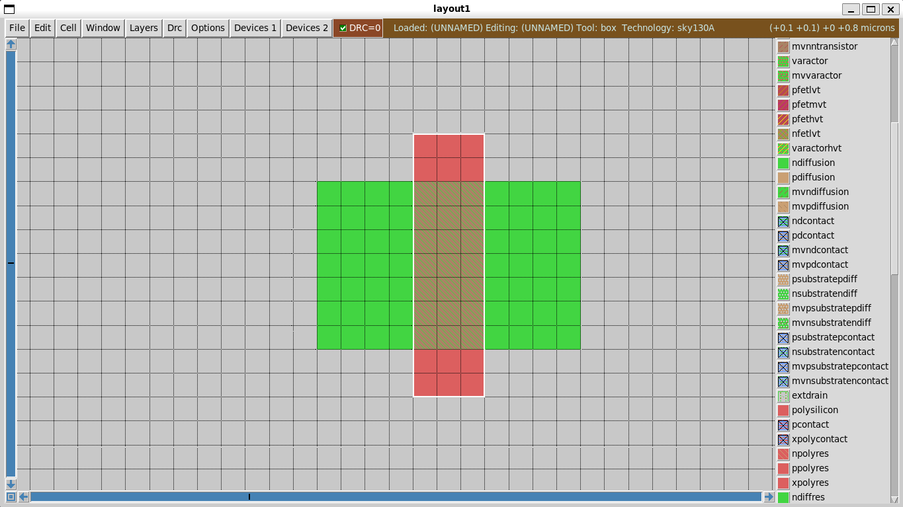

# Magic VLSI: Drawing an NMOS Transistor

## ⚠️ Important: Proper Startup Command

**Do NOT run `magic` alone!** Always use:

```bash
export PDK_ROOT=/home/timi/eda_tools/open_pdks/sky130
magic -rcfile /home/timi/eda_tools/open_pdks/sky130/sky130A/libs.tech/magic/sky130A.magicrc
```

## Quick Start Guide

### 1. Opening Magic
Two windows appear:
- **Layout window** - Draw your design
- **Console window** - Type commands

### 2. Setup Grid
`Window → Grid` → Set to 0.1 µm or 0.5 µm

### 3. Drawing Basics
- **Right-click** - Resize box
- **Left-click** - Move box
- **Paint layer** - `paint poly` or middle-click layer
- **Delete** - Draw box, press `s` then `d`

### 4. Create NMOS Transistor

```tcl
# Step 1: Draw N-diffusion
paint ndiffusion

# Step 2: Draw polysilicon crossing it
paint poly
```

Magic automatically creates `ntransistor` where poly crosses N-diffusion!

**Example Output:**



*Striped pattern shows the ntransistor region formed*
```

## Common Commands

```tcl
paint ndiffusion    # N-type diffusion
paint poly          # Polysilicon (gate)
paint metal1        # Metal layer
select              # Select area
erase <layer>       # Remove layer
drc check           # Check design rules
zoom 2              # Zoom in
```

## Key Concepts

- Layout is **top view** of fabrication layers
- **Poly over N-diffusion** = NMOS transistor
- DRC validates design rules
- Each layer has unique color

## Resources

- [Magic Documentation](http://opencircuitdesign.com/magic/)
- [Skywater PDK](https://skywater-pdk.readthedocs.io/)