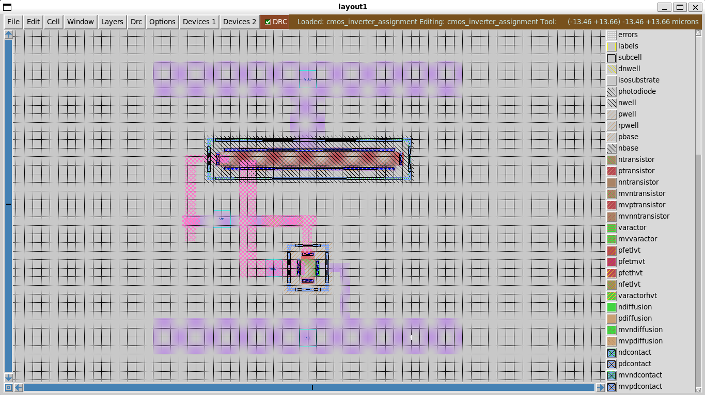
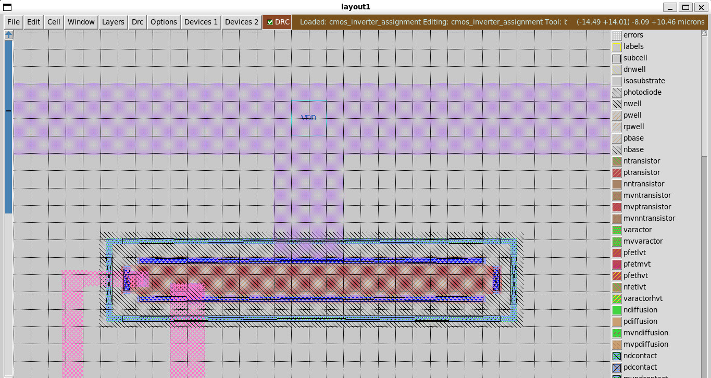
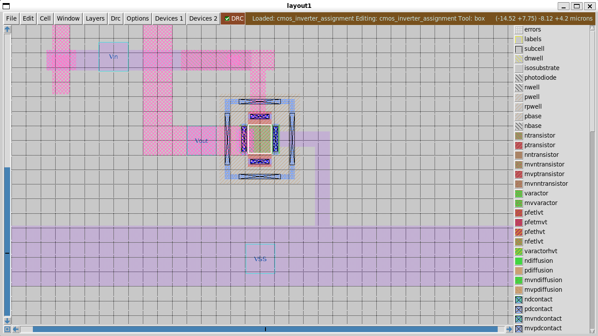

# CMOS Inverter Layout – Routing 

## Layout Diagram

*Figure 1: CMOS Inverter layout showing PMOS (top) and NMOS (bottom) with DRC=0*

---

*Figure 2: CMOS Inverter Layout (Upper Half with VDD port)*

---

*Figure 3: CMOS Inverter Layout (Lower Half with the Vin, Vout, and VSS ports)*

---

## Layout Arrangement

* `VDD` placed at the top, `GND` at the bottom
* PMOS near `VDD`, NMOS near `GND`
* Devices arranged **vertically** (stacked on top of each other)

## Routing Strategy

* Same metal layers touching = connection
* Different layers do not connect without contacts or vias

## Drain Connection (Output Node)

* PMOS drain is connected to NMOS drain
* Routed using `Metal2` to avoid shorting with body contacts on `Metal1`
* `Via1` is used to connect `Metal2` to the `Metal1` drain contacts

## Source Connections

* PMOS source → `VDD` (`Metal1`)
* NMOS source → `GND` (`Metal1`)
* Body contacts tied to their respective supplies

## Gate Connection

* PMOS gate and NMOS gate are connected together
* Routed using `Metal2` to cross body contacts safely
* `Via1` used at gate contacts to connect `Metal1` ↔ `Metal2`

## Design Rule Check (DRC)

* Ensure proper via overlap and minimum metal spacing
* Fix any DRC violations before finalizing layout

## Key Notes

* Contacts and vias are the only way to connect different layers
* `Metal2` is used to avoid unintended shorts
* Always run DRC after routing

---
