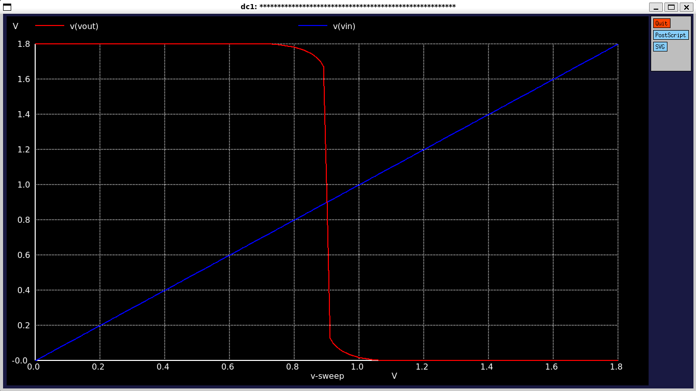

# CMOS Inverter - Transient Analysis

## Overview
Transient analysis is used to observe the switching behavior of the CMOS inverter over time. This analysis helps verify proper inverter operation and characterize switching delays.

## Setup

### Input Signal
- **Vin**: A pulse voltage source simulates digital transitions (0 → 1 and 1 → 0)

### Output Observation
- **Vout**: Voltage at the inverter output shows rise/fall response to Vin

### Load Modeling
- **Cload**: Capacitive load at the output models the inverter driving other gates in the circuit

## Simulation Configuration

### SPICE Directive
The `.tran` directive is used to run the transient simulation in Xschem/Ngspice:

```spice
.tran <tstep> <tstop>
```

## Analysis and Results

### Verification Steps
1. Plot **Vout vs Time** alongside **Vin vs Time**
2. Verify proper inverter operation (output inverts input)
3. Measure switching delays (propagation delays)
4. Analyze rise and fall times

### Expected Behavior
- The inverter output should switch cleanly between logic 0 (GND) and logic 1 (VDD)
- Rise and fall times should be within expected ranges
- No significant ringing or oscillations during transitions

## Transient Response Waveform


*Figure: Input (Vin) and Output (Vout) waveforms showing inverter switching behavior*

## Waveform Observations

* X-axis: time (ns) - time domain
* Input Vin (blue): pulse waveform (0→1.8V→0V)
* Output Vout (red): inverted response showing the switching behavior
* Clear rise and fall transitions
* Inverter operation verified: when Vin is high, Vout is low and vice versa

## Notes
- Ensure proper timestep selection for accurate waveform capture
- Capacitive load value affects switching speed
- Temperature and process variations can impact timing characteristics