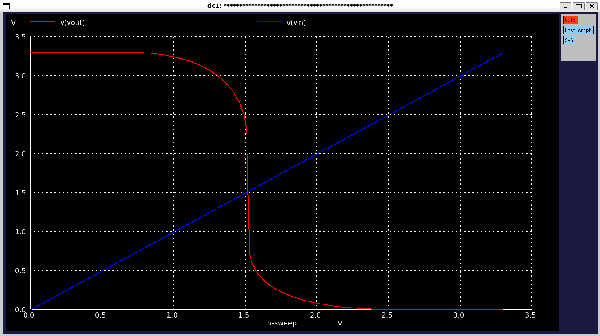
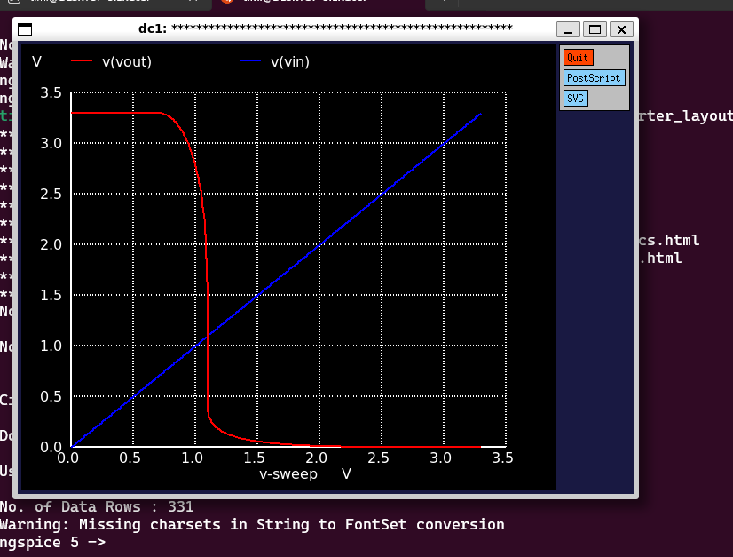
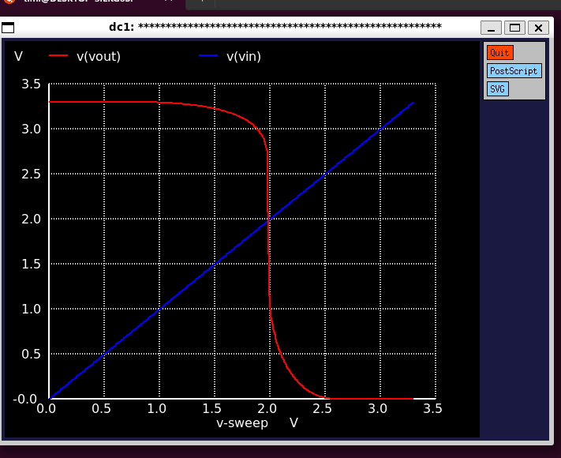
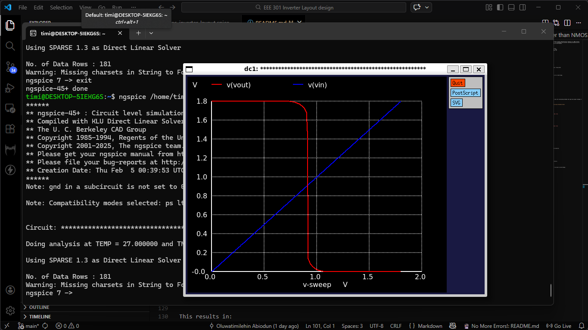

# CMOS Inverter DC Analysis (ngspice)

This project demonstrates the DC sweep (Voltage Transfer Characteristic) analysis of a CMOS inverter using **ngspice** and Sky130 device models. It investigates the inverter switching threshold and the impact of transistor sizing on noise margin and performance.

---

## Objectives

* Perform DC sweep analysis of a CMOS inverter
* Plot the Voltage Transfer Characteristic (VTC)
* Determine the switching threshold voltage (Vm)
* Study the effect of PMOS/NMOS sizing
* Prepare for physical layout design

---

## Tools & Technologies

* **ngspice**
* **Sky130 PDK**
* **Xschem** (schematic capture)
* Linux environment

---

## DC Sweep Syntax

The DC sweep command follows this syntax:

```spice
.dc <source_name> <start_value> <stop_value> <step_value>
```

Example:

```spice
.dc Vin 0 3.3 0.01
```

This sweeps the input voltage from 0V to 3.3V in 0.01V steps.

---

## Simulation Setup

1. Comment out transient analysis:

```spice
*.tran 1n 100n
```

2. Enable DC sweep:

```spice
.dc Vin 0 3.3 0.01
```

3. Run simulation and plot:
   * `V(out)`
   * `V(in)` (optional)

---

## Voltage Transfer Characteristic (VTC)

> 

The Voltage Transfer Characteristic (VTC) shows the relationship between the input and output voltages of the CMOS inverter.

Key observations:
* **Vin low → Vout high**
* **Vin high → Vout low**
* The point where `Vin ≈ Vout` is the **switching threshold (Vm)**

For this design:
```
Vm ≈ 1.6 – 1.7 V (for VDD = 3.3 V)
```

---

## Effect of Transistor Sizing

### Case 1: PMOS width smaller than NMOS (Wp < Wn)



#### Wp = 0.2u, Wn = 1u 

* Switching point shifts left
* Reduced noise margin for logic '0'
* Skewed VTC curve

**Not recommended**

---

### Case 2: PMOS width larger than NMOS (Wp >> Wn)



#### Wp = 13u, Wn = 1u

* Switching point shifts right
* Reduced noise margin for logic '1'
* Narrow valid high-input range

**Not recommended**

---

### Optimal Design (Balanced Inverter)



#### Wp = 1.7u, Wn = 1u

To achieve a symmetric transfer curve:

```
βn ≈ βp
```

Since electron mobility is higher than hole mobility:

```
Wp ≈ 2 × Wn
```

This results in:
* Switching point near **VDD/2**
* Maximum noise margins
* Reliable logic operation

---

## Engineering Significance

The switching threshold voltage directly affects:
* Noise margins
* Logic robustness
* Power consumption
* Propagation delay
* Reliability of digital systems

Proper transistor sizing is essential for functional silicon design.

---

## Design Flow Progress

Completed:
* Schematic design
* DC sweep analysis

Next steps:
* Physical layout (Magic / KLayout)
* DRC (Design Rule Check)
* LVS (Layout vs Schematic)
* Parasitic extraction
* Post-layout simulation

