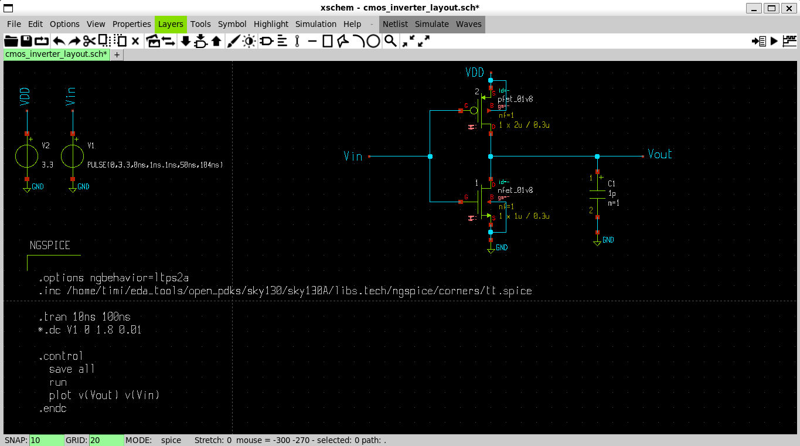

# Schematic Design

## Overview

The CMOS inverter consists of an NMOS and a PMOS transistor configured to provide logic inversion with rail-to-rail output swing.

---

## Schematic Diagram



---

## Circuit Components

### Fabricable Components
* **NMOS transistor** (from PDK library)
* **PMOS transistor** (from PDK library)

### Simulation-Only Components
* **VDD** (voltage source)
* **Vin** (input voltage source)
* **GND** (ground reference)
* **Cload** (capacitive load)

> **Note**: Voltage sources and ground are added for simulation only; they are not fabricable components.

---

## Transistor Selection

* Select transistors from the **PDK library** (e.g., Sky130)
* Ensure **NMOS and PMOS are from the same process node**
* Use compatible device models for accurate simulation

---

## Wiring Connections

| Connection | Description |
|------------|-------------|
| **Gates** of NMOS and PMOS | → Connected to **input** |
| **Drains** of NMOS and PMOS | → Connected to **output** |
| **PMOS source** | → Connected to **VDD** |
| **NMOS source** | → Connected to **GND** |

---

## Capacitive Load (Cload)

* Models the **fan-out** of the inverter
* Added at the **output node**
* Represents realistic loading conditions
* Affects propagation delay and rise/fall times

---

## Transistor Sizing

### NMOS Sizing
```
W/L = 1 μm / 0.3 μm
```

### PMOS Sizing
```
W/L = 2 μm / 0.3 μm
```

### Design Rationale

* **PMOS width ≈ 2× NMOS width** to match drive strength
* Compensates for lower hole mobility compared to electron mobility
* Ensures the inverter switching voltage (VM) ≈ **VDD/2**
* **Maximizes noise margin** for robust logic operation

---

## SPICE Directives in Xschem

SPICE simulation commands are added using `code_shown.sym` in Xschem:

### DC Sweep Analysis
```spice
.dc Vin 0 1.8 0.01
```

### Transient Analysis
```spice
.tran 1n 100n
```

---

## Best Practices

* **Use PDK devices** for components intended for fabrication
* **Use Xschem components** (voltage sources, ground) for simulation only
* **Size PMOS to balance NMOS** drive strength
* **Add load capacitance** for realistic behavior modeling
* **Use net labels** to simplify connections instead of long wires

---

## Key Design Goals

| Goal | Achieved By |
|------|-------------|
| Symmetric switching | PMOS width ≈ 2× NMOS width |
| VM ≈ VDD/2 | Balanced transistor sizing |
| Maximum noise margin | Proper W/L ratios |
| Realistic simulation | Adding Cload at output |

---

## Design Summary

```
Circuit Type:     CMOS Inverter
Technology:       Sky130 PDK
NMOS W/L:        1 μm / 0.3 μm
PMOS W/L:        2 μm / 0.3 μm
Switching Point:  VM ≈ VDD/2
Load Capacitance: User-defined (Cload)
```

---

**Focus**: Use PDK devices for fabrication, Xschem components for simulation, size PMOS to balance NMOS, and add load for realistic behavior.